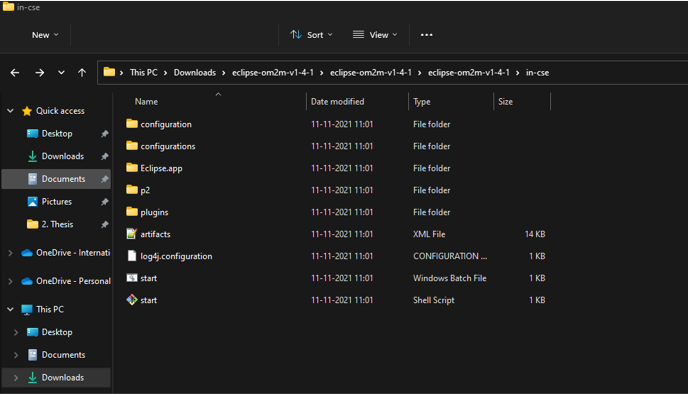

# Smart Cadence Meter

__“Cadence”__ - the speed at which they pedal (measured in terms of the revolutions per minute of the crank and pedals).

A cadence meter would perform the same job as the tachometer in a car and help us change gears correctly. Storing the cadence data for the entire trip would enable us to perform analysis like graphing etc. to understand patterns and improve.
The __ESP32 Devkit__ 1 contains an inbuilt hall effect sensor. By mounting a magnet on one of the pedals, we shall use the change in strength of the magnetic field w.r.t time to calculate the rpm of the crank. This data is posted to OneM2M based cloud and can be later retrieved and displayed.

## Software requirements

1. Arduino https://www.arduino.cc/en/software and respective libraries
2. Latest version of OM2M
https://wiki.eclipse.org/OM2M/Download 

1. Java (Open JDK version: 1.8.0_XXX/ jdk-8u151

    https://www.oracle.com/in/java/technologies/javase/javase8-archive-downloads.html#license-lightbox
    Set JAVA_HOME 
    https://javatutorial.net/set-java-home-windows-10

    Ubuntu:
    https://computingforgeeks.com/how-to-install-java-8-on-ubuntu/
    sudo update-alternatives --config java
    (https://www.xmodulo.com/change-default-java-version-linux.html)

## Hardware requirements
1. ESP32 module
2. Strong magnet
3. LEDs
4. Jumper wires

## Demonstration

https://iiitaphyd-my.sharepoint.com/:v:/g/personal/gupta_pratham_students_iiit_ac_in/EU0wuNRYv-NFsqwbzJXERrYB72P38oSTJWkztiicn1bNaA?e=uAz4Gs

## Launch oneM2M

1. Open the OM2M platform by executing the "start.bat" script on Windows or "start.sh" on Linux and Mac OS.

2. Open http://127.0.0.1:8080/webpage in browser. Type admin as username and password

## Run instructions
1. Follow the presentaion in _Docs_ folder and the demo video above for connections
2. Run the python script _init.py_ to initiate containers on the oneM2M middleware
3. Run main_code.ino on arduino
4. Access cloud database from http://127.0.0.1:8080/webpage
5. Run the python script _m.py_ to initiate the cadence webapp
6. Access the webapp at http://127.0.0.1:5000/